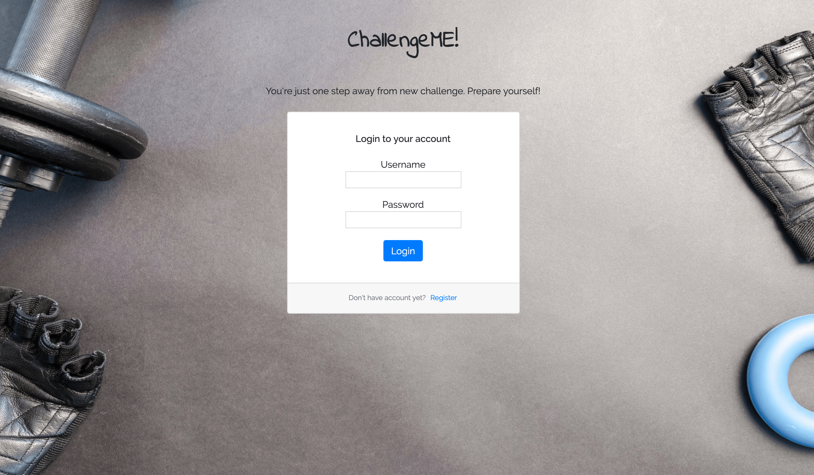

# FrontChallengeME
This project was made by:
- [Weronika Dębowska](https://github.com/WeronikaDebowska) (mostly backend)

and

- [Ewelina Kijanowska](https://github.com/EwelinaKi) (mostly frontend)

This SPA is a web service for creating a challenges for you and your friends. It can be all kinds of challenges like for example sporty, reading or educational. After creating a new challenge you can invite your friends to join it. Have fun!

## Dependencies
- Angular 7.1.4
- Bootstrap 4

## Backend server
If you want to run the backend server go to [this repository](https://github.com/WeronikaDebowska/BackChallengeME).

## Development server
To view this project first run `npm install` and then `ng serve -o` to start a dev server. Your default browser will automatically open `http://localhost:4200/` address.

## Build

Run `ng build` to build the project. The build artifacts will be stored in the `dist/` directory. Use the `--prod` flag for a production build.

## Running unit tests

Run `ng test` to execute the unit tests via [Karma](https://karma-runner.github.io).

## Running end-to-end tests

Run `ng e2e` to execute the end-to-end tests via [Protractor](http://www.protractortest.org/).
